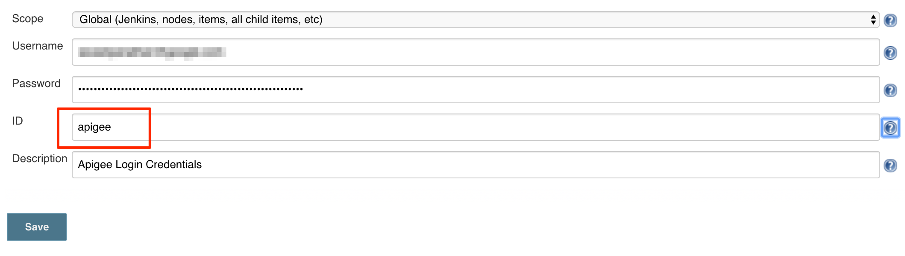

# apigee-ci-cd

- Fork this repo
- In the [pom file](pom.xml), update the `apigee.org` property under `test` and `prod` POM profile to point to your Apigee org
- The repo has a Jenkinsfile with the build info, so you can automatically import this repo using the Blue Ocean UI
- Please configure the Apigee crendetials in Jenkins. The current Jenkinsfile uses `apigee` as the ID. If you wish to change that, please update the Jenkinsfile with the provided ID under the `environment` section - `APIGEE_CREDS = credentials('apigee')`

